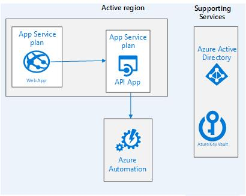

# Introduction 
This is a Demo and PoC on how to use Webapp with REST API to automated Azure Tasks. This demo will focus on start and stop Vms for multiplate resource groups

# Getting Started
1.  Design Diagram
1.	Software Requirement
3.	How to install it
4.	API references
5.  Reference

# Design Diagram
The demo will consist off 
1. Web App: where user can login with AD credition and see thier resource groups
2. Rest API: It will communicate with automation services
3. KeyVault: to store secret keys
4. Automation services: It will manage the start and stop VMs based on the defined schedule
5. AAD: to authenicate users

# Software Requirement
1. REST API will be build in Python and container after
2. Web App will be in Python Django
3. App plans for Linux

# Automation Requirement
 ## <b>Automation Account:</b> 
 The automation account will manage the runbook and schedule and it. Automation account will create <b>Service Principle Account</b>. It is very important to capture this SP. 

 <b> The Automation Service Principle account</b> must assign contributor role over any subscription where user can schedule stop/start for his VM(s)

 <b> We will need to capture SP ApplicationID and Secret and store it in Azure Key Vault </b>

 ## <b>Azure RunBooks </b>
 we will need two runbooks. 
 -  One for start VM calls `Start-AzureV2VMs` and source code can be found under `docs\start-script.ps`

- One for stop VM calls `Stop-AzureV2VMs`and source code can be found under `docs\stop-script.ps`

## <b> Azure Container Registery </b>
ACR is required to store the automation api app container and web app container. <b> please enable username and password </b> so user can user docker to login to the ACR username and password to build container and push the code.

## <b> AD App Registration for automation web app</b>
Register AAD app and grant permission for Azure Graph API User read profile. This SP will allow the Web App to get user profile information.
Grant also Azure Management resouce to allow the webapp to authenticate with AAD.
<b> please record the APPID and Secret information </b> to add to Azure Key Valut also to grant access policy to Azure Key Vault.

## <b> Azure App Plan for Linux </b>
The resouce will host the webapp and webapiapp. so the resouce required to be at least 14GB for better performance.

## <b> Azure Web App for containers </b>
-   Automation REST API app: Linux base web app to host the automation API container. <b>Idenity must be enable</b> the system will generate a GUID once Idenity is recorded. please record the GUID to enable it with <b> Azure Key Vault</b>. The web API will run using automation SP idenity. The web API will read the identity from Azure Key Vault.  
<b>The following app settings need to be added:</b>  

    | Setting Name  | Description |
    |---------------|-------------|
    |AUTHENTICATION_ENDPOINT |AAD Authentication URL https://login.microsoftonline.com/             |
    |KEY_VAULT              | KV endpoint URL            |
    |RESOURCE| Azure management resources set to https://management.core.windows.net/|
    |RESOURCE_KV|Azure KV resources set to https://vault.azure.net|
    |WEBSITES_PORT|Web app port default to 5000|
  

-   Automation web app: Linux base web app to host the automation web container. <b>Idenity must be enable</b> the system will generate a GUID once Idenity is recorded. please record the GUID to enable it with <b> Azure Key Vault</b>. The web appwill run using Graph SP idenity. The web API will read the identity from Azure Key Vault.< <b>The following app settings need to be added:</b>  

    | Setting Name  | Description |
    |---------------|-------------|
    |API_VERSION   | AAD Authenticatation version usually 1.0       |
    |AUTHENTICATION_ENDPOINT |AAD Authentication URL https://login.microsoftonline.com/             |
    |ENCRYPTION_KEY   | Web application auto generation encrypition key             |
    |KEY  | Web SP for Graph secret key -- it will be removed in future release             |
    |CLIENT       |Web SP for Graph AppID -- it will be removed in future release               |
    |KEY_VAULT              | KV endpoint URL            |
    |OAUTHLIB_INSECURE_TRANSPORT| Web App setting set to True| 
    |OAUTHLIB_RELAX_TOKEN_SCOPE|Web App setting set to True|
    |RESOURCE| Azure management resources set to https://management.core.windows.net/|
    |RESOURCE_GRAPH| Azure Graph resources set to https://graph.microsoft.com|
    |RESOURCE_KV|Azure KV resources set to https://vault.azure.net|
    |REST_API_ENDPOINT|Automation REST API web app URL|
    |SUBSCRIPTION_ID|Web App Subscription|
    |TENANT|Web app Tenant name url set to <yourtenant>.onmicrosoft.com|
    |TENANT_ID|your tenant ID|
    |WEBSITES_PORT|Web app port default to 8000|
  
Once the web app is generated please record the web url and modify the AAD SP for web app by adding the web app url under "Redirect URLS"

## <b> Azure Storage </b>
Azure storage Account will be needed to enable log stream.

## <b> Azure Key Vault </b>
The key vault will be azure managment api endpoint will be stored. Also other needed configuration will be stored there like web app SP for graph and resources, automation account SP.   

| KV Secret Name  | Description | Default Value |
|---------------|-------------|-------------|
|automation-account| Automation resource name|azure-infra-automation-account|
|automation-group| Automation resouce group name|azure-infra-automation-mrg|
|automation-endpoint|Azure management API for automation|https://management.azure.com/subscriptions/%s/resourceGroups/%s/providers/Microsoft.Automation/automationAccounts/%s?api-version=2015-10-31|
|subscriptions-endpoint|Azure management API for subscription list|https://management.azure.com/subscriptions/?api-version=2015-01-01|
|resourcegroups-endpoint|Azure management API for resource group list for under specific sub id|https://management.azure.com/subscriptions/%s/resourcegroups/?api-version=2015-01-01|
|resourcegroup-endpoint|Azure management API for resource group  detail providing sub id and resource group name |https://management.azure.com/subscriptions/%s/resourcegroups/%s?api-version=2015-01-01|
|runbooks-endpoint|Azure management API for runbooks list under automation account|https://management.azure.com/subscriptions/%s/resourceGroups/%s/providers/Microsoft.Automation/automationAccounts/%s/runbooks?api-version=2015-10-31|
|runbook-endpoint|Azure management API for runbook detail under automation account |https://management.azure.com/subscriptions/%s/resourceGroups/%s/providers/Microsoft.Automation/automationAccounts/%s/runbooks/%s?api-version=2015-10-31|
|runbook-schedules-list-endpoint|Azure management API list of linked scheduler to runbook under automation account|https://s2.automation.ext.azure.com/api/Orchestrator/SchedulesByRunbook?runbookId=%s|
|runbook-content-endpoint|Azure management API runbook content detail (poweshell, python..) under automation account|https://management.azure.com/subscriptions/%s/resourceGroups/%s/providers/Microsoft.Automation/automationAccounts/%s/runbooks/%s/content?api-version=2015-10-31|
|runbook-parameter-endpoint|runbook resouce id as parameter for creating schedule link call/subscriptions/%s/resourceGroups/%s/providers/Microsoft.Automation/automationAccounts/%s/runbooks/%s|
|runbook-start|Start Vms rubbook name|Start-AzureV2VMs|
|runbook-stop|Stop Vms runbook name|Stop-AzureV2VMs|
|runbook-schedule-parameters-endpoint|Azure management API under automation account|https://s2.automation.ext.azure.com/api/Orchestrator/ParametersForScheduleRunbook?runbookId=%s&scheduleId=%s|
|schedule-parameter-endpoint|schedule resouce id as parameter for creating schedule link call|/subscriptions/%s/resourceGroups/%s/providers/Microsoft.Automation/automationAccounts/%s/schedules/%s|
|schedule-endpoint|Azure management API for schedule detail under automation account|https://management.azure.com/subscriptions/%s/resourceGroups/%s/providers/Microsoft.Automation/automationAccounts/%s/schedules/%s?api-version=2015-10-31|
|schedules-endpoint|Azure management API for schedule list under automation account|https://management.azure.com/subscriptions/%s/resourceGroups/%s/providers/Microsoft.Automation/automationAccounts/%s/schedules?api-version=2015-10-31|
|runbook-schedule-endpoint|Azure management API under automation account|https://s2.automation.ext.azure.com/api/Orchestrator/LinkRunbookToSchedule?runbookId=%s&scheduleId=%s|
|jobs-endpoint|Azure management API job list under automation account|https://management.azure.com/subscriptions/%s/resourceGroups/%s/providers/Microsoft.Automation/automationAccounts/%s/jobs?api-version=2018-06-30|
|job-endpoint|Azure management API job detail under automation account|https://management.azure.com/subscriptions/%s/resourceGroups/%s/providers/Microsoft.Automation/automationAccounts/%s/jobs/%s?api-version=2018-06-30|
|job-control-endpoint|Azure management API job run detail under automation account|https://management.azure.com/subscriptions/%s/resourceGroups/%s/providers/Microsoft.Automation/automationAccounts/%s/jobs/%s/%s?api-version=2018-06-30|
|job-schedules-endpoint|Azure management API for job run schedule list under automation account|https://management.azure.com/subscriptions/%s/resourceGroups/%s/providers/Microsoft.Automation/automationAccounts/%s/jobSchedules?api-version=2015-10-31|
|job-schedule-endpoint|Azure management API  job schedule detail under automation account|https://management.azure.com/subscriptions/%s/resourceGroups/%s/providers/Microsoft.Automation/automationAccounts/%s/jobSchedules/%s?api-version=2015-10-31|
|role-assignment-endpoint|Azure management API for role assignments list under sub id providing user princple id|https://management.azure.com/subscriptions/%s/providers/Microsoft.Authorization/roleAssignments?$filter=principalId eq '%s'&api-version=2015-07-01|
|role-assignment-name||
|rest-api-endpoint| Web app REST API URL |https://azure-infra-automation-api.azurewebsites.net|
|ignore-groups|Group to be ignored from disply for example automaton rg name|azure-infra-automation-mrg|
|subscriptionid|Subscription account for the automation SP||
|tenantid|Your  Tenant ID||
|tenant| Tenant name for under AAD |<your tenant>.onmicrosoft.com|
|client|Automation SP Application ID||
|key|Automation SP secret Key||

# How to install it
    1- Make sure the assets installed and configured
    2- All the app setting anbd key vault secrets in place
    3- Log into Azure ACR using `docker login` and provide the username and password.
    4- clone git repo 

    5- change directory to `src\api` and run docker build file `docker build -t <ACR URL>\<automation-api-web-name>:tag . `
    6- Run docker push ` docker push <ACR URL>\<automation-api-web-name>:tag` 
    7- From the portal go to webapp instance and modify the Container Setting to reflect the container name and tag.
    8- Restart the WebAPP / Web API
    9- In many case clear the cache to see the new changes.

# Reference
- [Automation](https://github.com/aspnet/Home)
- [App Services](https://github.com/Microsoft/vscode)
- [KeyValue](https://github.com/Microsoft/ChakraCore)
- [Active Directory](https://docs.microsoft.com/en-us/azure/active-directory/)

